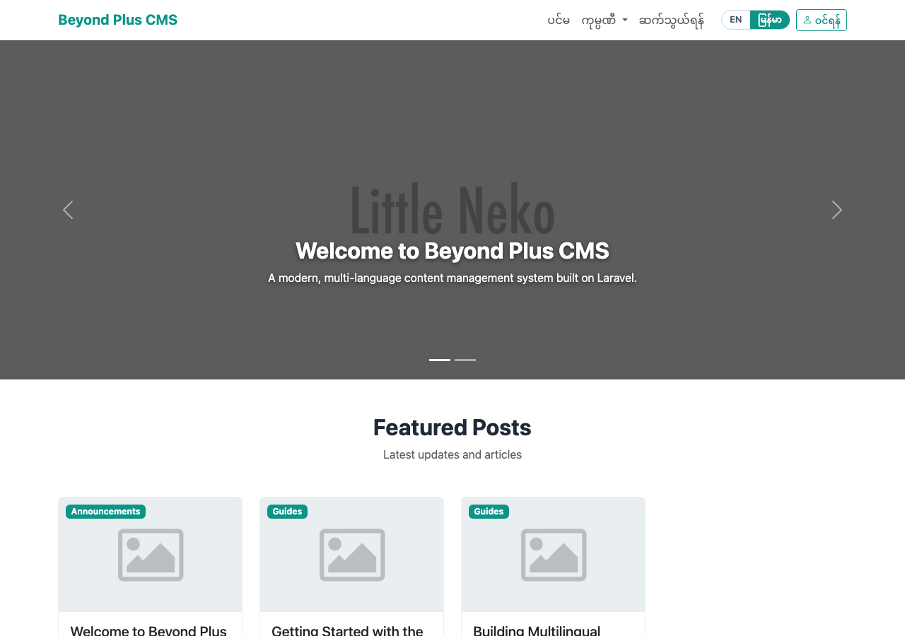
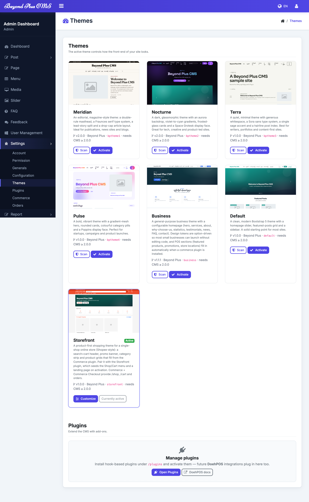
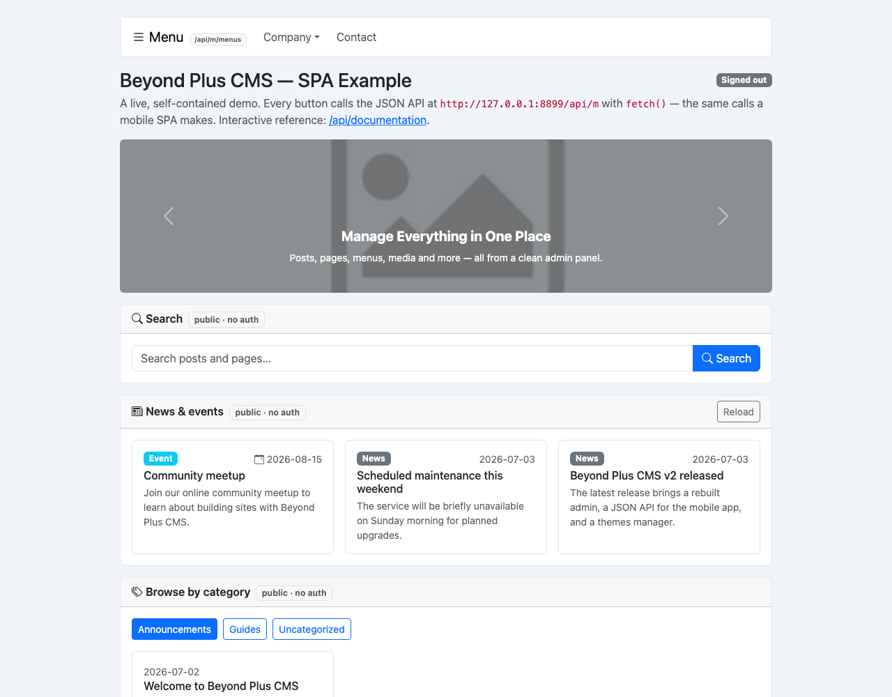
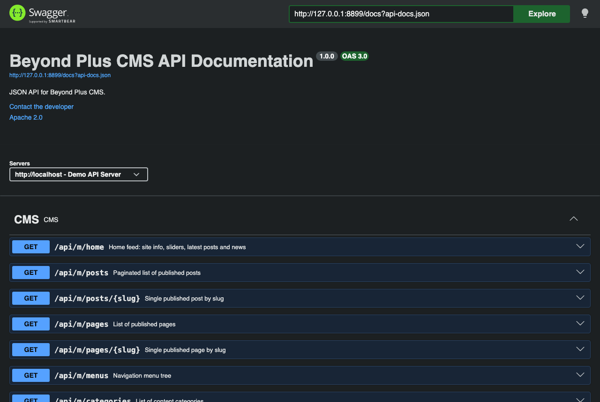
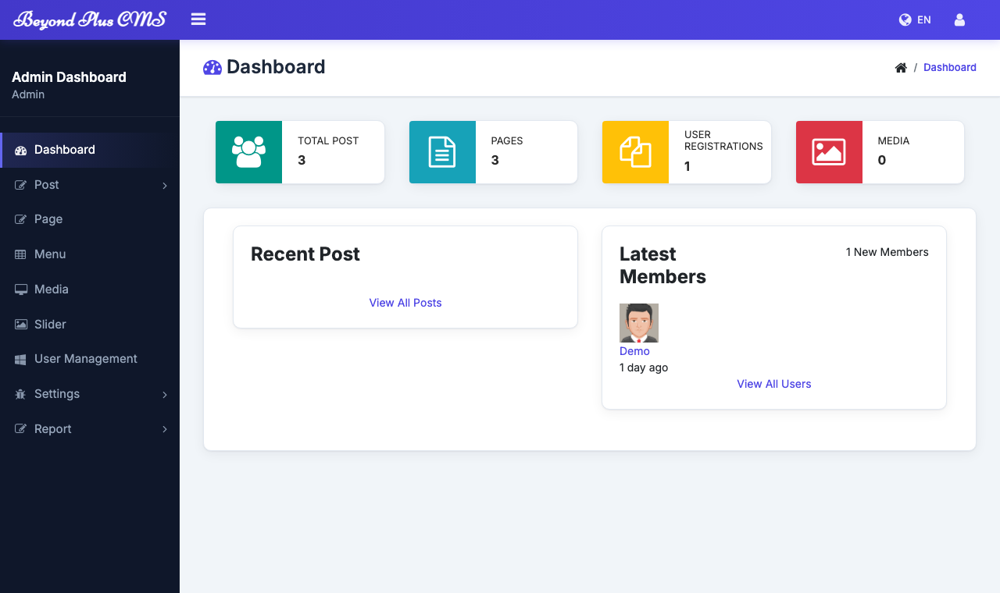

# Beyond Plus CMS

**Laravel 13** (PHP 8.3+) ပေါ်တွင် တည်ဆောက်ထားသော ဘာသာစကားမျိုးစုံသုံး
အကြောင်းအရာ စီမံခန့်ခွဲမှုစနစ် (content-management system) တစ်ခုဖြစ်ပါသည်။
စီမံခန့်ခွဲသူ panel (`/bp-admin`)၊ ဘာသာစကားအလိုက် ခွဲထားသော အများသုံးစာမျက်နှာများ၊
ပုံစံ (theme) စနစ် နှင့် Swagger ဖြင့် မှတ်တမ်းတင်ထားသော token ဖြင့်စိစစ်သည့်
JSON API တို့ ပါဝင်ပါသည်။

## မျက်နှာပြင်ဓာတ်ပုံများ (Screenshots)

| ရှေ့ဆုံးစာမျက်နှာ | စီမံခန့်ခွဲမှု — ပုံစံများ |
|---|---|
|  |  |
| **SPA နမူနာစာမျက်နှာ** (`/spa-example.html`) | **API စာရွက်စာတမ်း** (Swagger) |
|  |  |

မီနူး စီမံခန့်ခွဲမှု —



## လိုအပ်ချက်များ (Requirements)

- PHP **8.3+**
- Composer 2
- MySQL / MariaDB
- Node.js (ရှေ့ဆုံး assets များကို ပြန်လည်တည်ဆောက်လိုမှသာ လိုအပ်ပြီး၊ တည်ဆောက်ပြီးသား assets များကို ထည့်သွင်းပေးထားပြီးဖြစ်ပါသည်)

## တပ်ဆင်ခြင်း (Installation)

```bash
# ၁။ PHP dependencies များ install လုပ်ပါ
composer install

# ၂။ environment file နှင့် app key ဖန်တီးပါ
cp .env.example .env
php artisan key:generate

# ၃။ .env ထဲတွင် database ကို သတ်မှတ်ပါ
#    DB_DATABASE=beyondplus_cms
#    DB_USERNAME=... DB_PASSWORD=...

# ၄။ database ဖန်တီးပြီး နမူနာ schema + data ကို import လုပ်ပါ
mysql -u root -p -e "CREATE DATABASE beyondplus_cms CHARACTER SET utf8mb4 COLLATE utf8mb4_unicode_ci;"
mysql -u root -p beyondplus_cms < database/sample-data.sql

# ၅။ Serve လုပ်ပါ
php artisan serve
```

`database/sample-data.sql` ကို import မလုပ်လိုပါက migrations မှတစ်ဆင့် schema ကို
တည်ဆောက်ပြီး seed လုပ်နိုင်ပါသည် —

```bash
php artisan migrate --seed
```

## စမ်းသပ်ရန် အကောင့်များ (Demo credentials)

နမူနာ data ထဲတွင် စမ်းသပ်ရန် စီမံခန့်ခွဲသူ တစ်ဦးနှင့် ဖောက်သည် (customer) တစ်ဦး ပါဝင်ပါသည် —

| အကောင့် | URL | ဝင်ရောက်ရန် | စကားဝှက် |
|---|---|---|---|
| စီမံခန့်ခွဲသူ | `/bp-admin/login` | `admin@example.com` | `password` |
| ဖောက်သည် | `/customer/sign-in` | ဖုန်း `09000000000` | `password` |

## စမ်းသပ်ခြင်း (Testing)

Feature / unit test suite ကို အောက်ပါအတိုင်း run နိုင်ပါသည်။ SQLite in-memory ဖြင့်
run သဖြင့် database သီးသန့် မလိုအပ်ပါ —

```bash
php artisan test
```

အမှားစာမျက်နှာ (error pages) များကို တကယ့်အမှား ဖြစ်စေစရာမလိုဘဲ
**`/preview-error/{code}`** တွင် ကြိုတင် ကြည့်ရှုနိုင်ပါသည် — ဥပမာ `/preview-error/404`၊
`/preview-error/500`။ ရရှိနိုင်သော code များ — `401`, `403`, `404`, `419`, `429`,
`500`, `503`။ `/en/preview-error/...` ဖြင့် အင်္ဂလိပ်ဗားရှင်းကို ကြည့်နိုင်ပါသည်။ ဤ route ကို
`APP_DEBUG=true` ဖြစ်နေချိန် သို့မဟုတ် စီမံခန့်ခွဲသူ ဝင်ရောက်ထားချိန်တွင်သာ အသုံးပြုနိုင်ပြီး၊
production တွင် ပုန်းကွယ်နေပါသည် (အခြားအခြေအနေတွင် `404`)။

## ပုံစံများ (Themes)

ရှေ့ဆုံး ပုံစံများကို `resources/views/theme/<name>/` တွင် ထားရှိပါသည်။ အသုံးပြုနေသော
ပုံစံကို `bp_options` table (`option_name = 'theme'`) တွင် သိမ်းဆည်းထားပြီး၊ မူလ
တန်ဖိုးမှာ `default` ဖြစ်ပါသည်။ နောက်ထပ် နမူနာပုံစံ (`bptheme1`, `bptheme2`) များလည်း
ပါဝင်ပါသည်။

## Mobile SPA အတွက် API

Mobile app သည် ဤ CMS နှင့် JSON API မှတစ်ဆင့် ဆက်သွယ်သည့် သီးခြား SPA တစ်ခုဖြစ်ပါသည်။
အပြန်အလှန်အသုံးပြုနိုင်သော စာရွက်စာတမ်း (OpenAPI / Swagger) ကို **`/api/documentation`**
တွင်၊ register / verify / login / profile / logout လုပ်ငန်းစဉ်ကို တိုက်ရိုက်ပြသသည့်
နမူနာစာမျက်နှာကို **`/spa-example.html`** တွင် ကြည့်ရှုနိုင်ပါသည်။

- **အခြေခံ URL:** `/api/m`
- **ပြန်ကြားချက် (Responses):** JSON ဖြစ်ပြီး `{ "status": <code>, "data": <payload>, "meta"?: <pagination> }` ပုံစံဖြင့် ပြန်ပေးပါသည်။
- **ဘာသာစကား:** အကြောင်းအရာ တောင်းဆိုမှုများတွင် `?lang=en` (သို့မဟုတ် မူလ `mm`) ကို ထည့်နိုင်ပါသည်။
- **ပိတ်ခလုတ်:** စီမံခန့်ခွဲမှု **Configuration** စာမျက်နှာတွင် API ကို ပိတ်လိုက်ပါက API တစ်ခုလုံး `503` ပြန်ပေးပါသည်။

### အများသုံး အကြောင်းအရာ (Public content — read-only)

စိစစ်မှု (auth) မလိုအပ်ပါ။ IP တစ်ခုလျှင် တစ်မိနစ်လျှင် **တောင်းဆိုမှု 60 ကြိမ်** အထိသာ
ခွင့်ပြုပါသည်။ စာရင်းပြသည့် endpoint များသည် `?page=` နှင့် `?per_page=` (အများဆုံး 50)
ကို လက်ခံပါသည်။

| Method & path | ဖော်ပြချက် |
|---|---|
| `GET /api/m/home` | ဆိုက်အချက်အလက်၊ sliders၊ နောက်ဆုံး posts၊ news |
| `GET /api/m/posts` · `GET /api/m/posts/{slug}` | Post စာရင်း (paginated) · post အသေးစိတ် |
| `GET /api/m/pages` · `GET /api/m/pages/{slug}` | Page စာရင်း · page အသေးစိတ် |
| `GET /api/m/menus` | မီနူး အပြင်အဆင် (tree) |
| `GET /api/m/categories` · `GET /api/m/categories/{slug}/posts` | ကဏ္ဍများ · ကဏ္ဍအလိုက် posts |
| `GET /api/m/sliders` · `GET /api/m/news` | Sliders · news (paginated) |
| `GET /api/m/search?q=` | posts နှင့် pages များကို ရှာဖွေခြင်း |

### ဖောက်သည် စိစစ်ခြင်း (Customer authentication)

Token အခြေခံ ဖြစ်ပါသည်။ အနိုင်အထက် ဝင်ရောက်မှု (brute force) ကို ကာကွယ်ရန်
စိစစ်မှု endpoint များကို IP တစ်ခုလျှင် တစ်မိနစ်လျှင် **တောင်းဆိုမှု 5 ကြိမ်** အထိသာ
ခွင့်ပြုပါသည်။ login သို့မဟုတ် verify အောင်မြင်ပါက **အက္ခရာ 64 လုံးပါ token** တစ်ခု
ပြန်ရရှိပြီး၊ ၎င်းကို ကာကွယ်ထားသည့် တောင်းဆိုမှုများတွင် **`X-BP-Token`** header ဖြင့်
ပေးပို့ရပါသည်။ Token များကို server ဘက်တွင် hash ပြုလုပ်၍ သိမ်းဆည်းထားပြီး၊ logout နှင့်
စကားဝှက် ပြန်လည်သတ်မှတ်သည့်အခါ ပယ်ဖျက်ပါသည်။

**၁။ အကောင့်ဖွင့်ခြင်း (Register)** — လိုအပ်သည့် fields များသည် စီမံခန့်ခွဲမှုတွင်
သတ်မှတ်ထားသော အကောင့်ဖွင့်နည်း (ဖုန်း၊ email၊ သို့မဟုတ် နှစ်မျိုးလုံး) အပေါ် မူတည်ပါသည်။
OTP တစ်ခု ပေးပို့ပါသည် (SMS/email provider မဖွင့်မချင်း `storage/logs/laravel.log` တွင် ရေးသားပါသည်)။

```bash
curl -X POST /api/m/auth/register \
  -d firstname=Aung -d phone=09123456789 \
  -d password=secret123 -d password_confirmation=secret123
# -> { "status":200, "data":{ "message":"...", "identifier":"09123456789" } }
```

**၂။ OTP စိစစ်ခြင်း** — token ကို ပြန်ပေးပါသည်။

```bash
curl -X POST /api/m/auth/verify -d identifier=09123456789 -d code=123456
# -> { "status":200, "data":{ "token":"<64-char>", "customer":{ ... } } }
```

**၃။ ဝင်ရောက်ခြင်း (Log in)** — ဖုန်း သို့မဟုတ် email နှင့် စကားဝှက်။

```bash
curl -X POST /api/m/auth/login -d identifier=09123456789 -d password=secret123
# -> { "status":200, "data":{ "token":"<64-char>", "customer":{ ... } } }
```

**၄။ စိစစ်ပြီးသား တောင်းဆိုမှုများ** — header တွင် token ကို ပေးပို့ပါ။

```bash
curl /api/m/account/profile -H "X-BP-Token: <token>"
curl -X POST /api/m/account/logout -H "X-BP-Token: <token>"   # token ကို ပယ်ဖျက်သည်
```

**စကားဝှက် ပြန်လည်သတ်မှတ်ခြင်း** — `POST /api/m/auth/forgot-password` (`identifier`) သည်
OTP တစ်ခု ပေးပို့ပါသည်။ အကောင့် ရှိ/မရှိကို ပြန်ကြားချက်က ဘယ်တော့မှ မဖော်ပြပါ။ ထို့နောက်
`POST /api/m/auth/reset-password` (`identifier`, `code`, `password`, `password_confirmation`)
ဖြင့် စကားဝှက်အသစ် သတ်မှတ်ပြီး ရှိပြီးသား tokens များကို ပယ်ဖျက်ပါသည်။

| Method & path | Auth | ဖော်ပြချက် |
|---|---|---|
| `POST /api/m/auth/register` | – | အကောင့်ဖွင့်၊ OTP ပို့ |
| `POST /api/m/auth/verify` | – | OTP စိစစ် → token |
| `POST /api/m/auth/login` | – | ဝင်ရောက် → token |
| `POST /api/m/auth/forgot-password` | – | reset OTP ပို့ |
| `POST /api/m/auth/reset-password` | – | စကားဝှက် ပြန်လည်သတ်မှတ် |
| `GET /api/m/account/profile` | `X-BP-Token` | လက်ရှိ ဖောက်သည် |
| `POST /api/m/account/logout` | `X-BP-Token` | token ပယ်ဖျက် |

## Configuration မှတ်စုများ

- **ဘာသာစကားများ:** `config/app.php` ၏ `locales` (`en`, `mm`) တွင် သတ်မှတ်ပါသည်။ `mm` ကို
  prefix မပါဘဲ ဝန်ဆောင်ပြီး၊ အခြားဘာသာစကားများကို ၎င်းတို့၏ prefix (ဥပမာ `/en/...`) ဖြင့် ဝန်ဆောင်ပါသည်။
- **Google Sheets/Drive ထုတ်ယူခြင်း** (optional): `.env` တွင် `GOOGLE_*` variables များ
  သတ်မှတ်ပြီး `storage/credentials.json` ကို ပေးပါ (`storage/credentials.json.example` ကို ကြည့်ပါ)။
- **ဖောက်သည် OTP / SMS / email:** ပေးပို့ခြင်းကို စီမံခန့်ခွဲမှု **Configuration** စာမျက်နှာတွင်
  သတ်မှတ်ပါသည် (SMS အတွက် SMSPoh၊ email အတွက် Mailgun)။ provider မဖွင့်မချင်း
  အကောင့်ဖွင့်ခြင်း / စကားဝှက် ပြန်လည်သတ်မှတ်ခြင်း အတွင်း ပေးပို့သည့် OTP ကို
  `storage/logs/laravel.log` တွင် ရေးသားပါသည်။

## လုံခြုံရေး (Security)

တကယ့် database dumps နှင့် OAuth credentials များကို `.gitignore` ဖြင့် တမင် ချန်လှပ်ထားပါသည်။
`.env`၊ production SQL dumps သို့မဟုတ် `storage/credentials.json` ကို ဘယ်တော့မှ commit မလုပ်ပါနှင့်။

**ဖိုင်တင်ခြင်း (uploads):** တင်လိုက်သည့်ဖိုင်များကို application layer တွင် ပုံ (image) ဟုတ်/မဟုတ်
စစ်ဆေးပြီး၊ ကျပန်း (random) အမည်ဖြင့်သာ သိမ်းသည် — ဤအကာအကွယ်သည် web server မည်သည်ဖြစ်စေ
အကျုံးဝင်ပါသည်။ ထပ်ဆောင်း အကာအကွယ်အဖြစ် `/uploads` အောက်တွင် script များ run ခြင်းကို ပိတ်ရန်:
Apache အတွက် `public/uploads/.htaccess` ကို ထည့်ပြီးဖြစ်ပြီး၊ **nginx** အတွက်
`docs/nginx-uploads.conf` ကို server config ထဲ ထည့်ပါ။

**စီမံခန့်ခွဲသူ ဝင်ရောက်မှု (Admin login)** — **Configuration → Admin login security** တွင်
စီမံနိုင်ပါသည်:

- **လျှို့ဝှက် login path (hardened login):** လျှို့ဝှက် slug တစ်ခု သတ်မှတ်ပါက စစ်မှန်သော login
  သည် `/bp-admin/<slug>` သို့ ရွှေ့သွားပြီး၊ `/bp-admin/login` သည် UI ကို ဆက်ပြသော်လည်း အမြဲ
  "invalid credentials" သာ ပြန်ပေးသည့် ဆွဲဆောင်စာမျက်နှာ (decoy) ဖြစ်သွားပါသည်။
- **နှုန်းကန့်သတ်ခြင်း (rate limiting):** login တောင်းဆိုမှုများကို IP တစ်ခုလျှင် **5 ကြိမ်** အထိသာ
  ခွင့်ပြုပြီး၊ ကျော်လွန်ပါက ခေတ္တ ပိတ်ဆို့ထားပါသည်။
- **Trusted proxies:** proxy / load balancer / Cloudflare နောက်ကွယ်တွင် အသုံးပြုပါက `.env` ၏
  `TRUSTED_PROXIES` (`*` သို့မဟုတ် IP/CIDR စာရင်း) ကို သတ်မှတ်ပါ — rate limiting နှင့် logging
  များ စစ်မှန်သော client IP ကို အသုံးပြုစေရန်။

**Developer log (500 စာမျက်နှာ):** Internal Server Error (500) ဖြစ်ပါက အများပြည်သူသည်
ဖော်ရွေသော စာမျက်နှာကိုသာ မြင်ရပြီး၊ **စီမံခန့်ခွဲသူ ဝင်ရောက်ထားသူ** သို့မဟုတ် Configuration ၏
**ခွင့်ပြု IP စာရင်း (allow-list)** ၌ ပါဝင်သော IP မှ လာသူများသာ အမှားအသေးစိတ်
(exception + stack trace) ကို မြင်ရပါသည်။

## လိုင်စင် (License)

[MIT license](https://opensource.org/licenses/MIT) အောက်တွင် open-source ပြုလုပ်ထားပါသည်။
